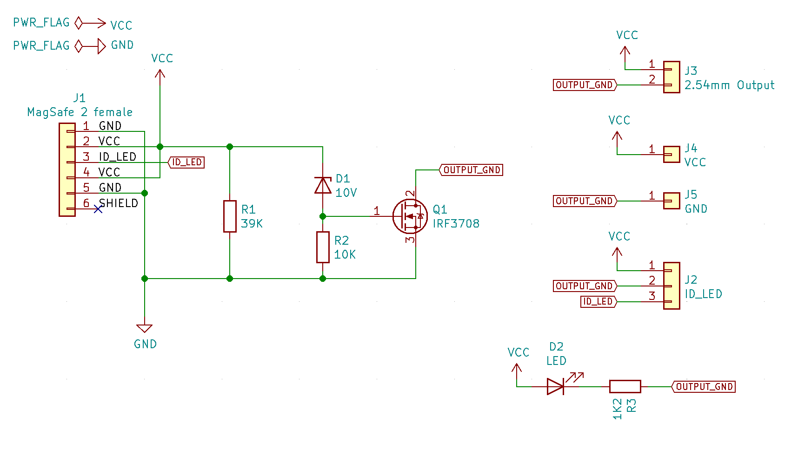
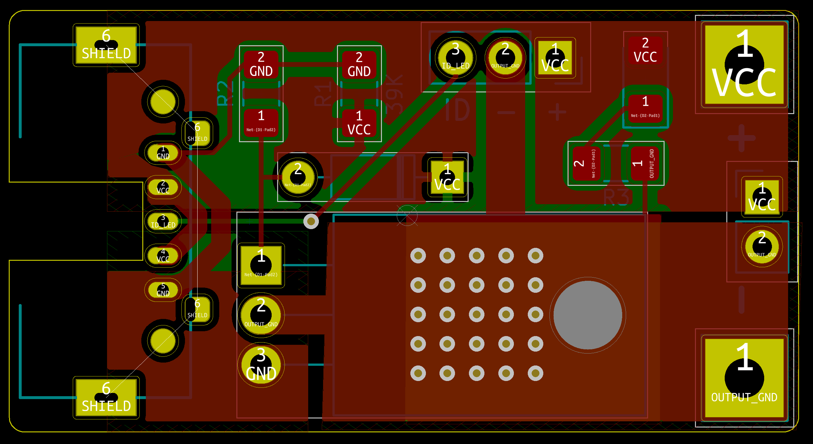
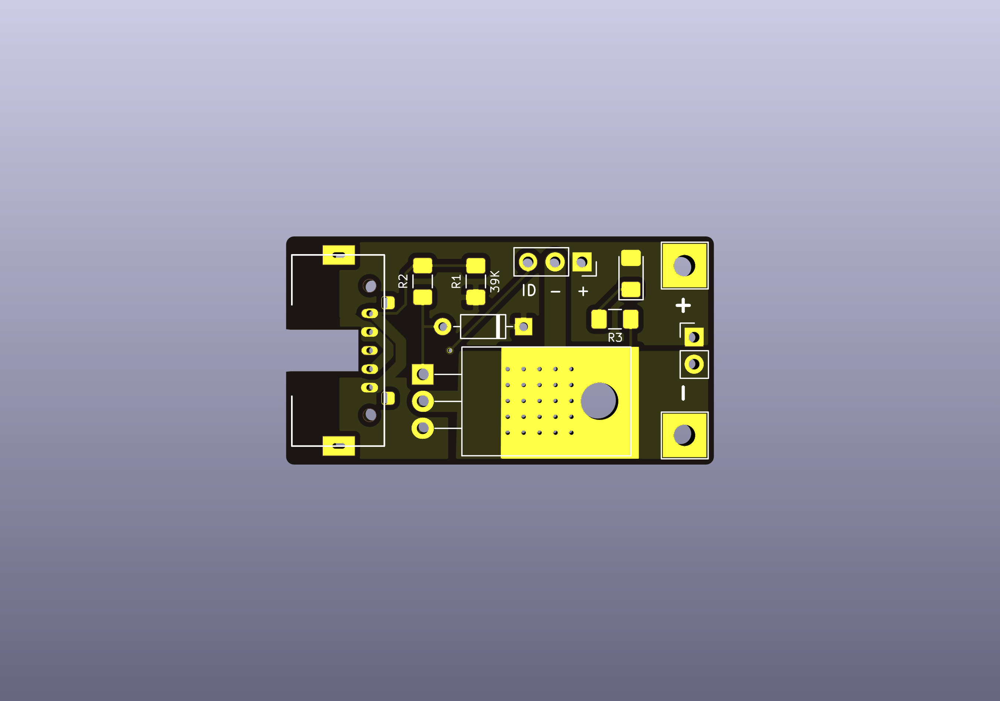
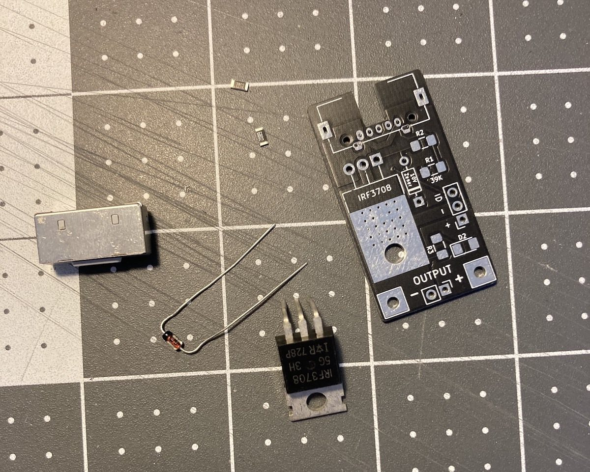
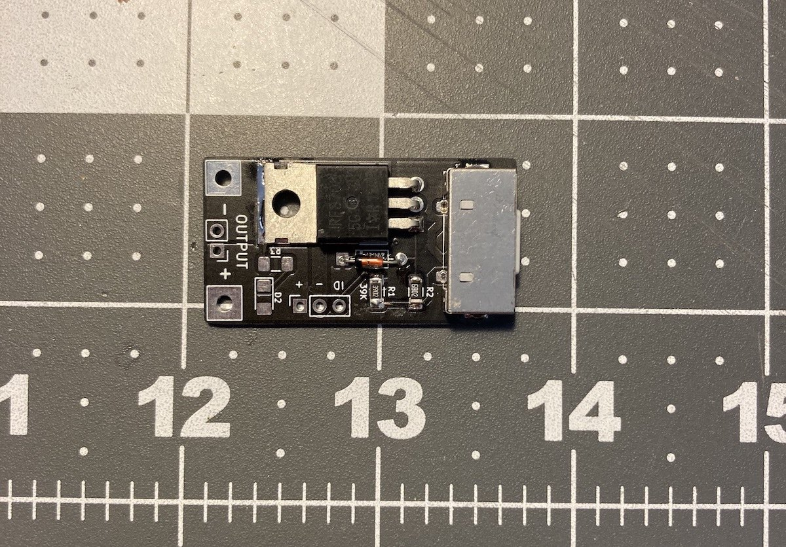
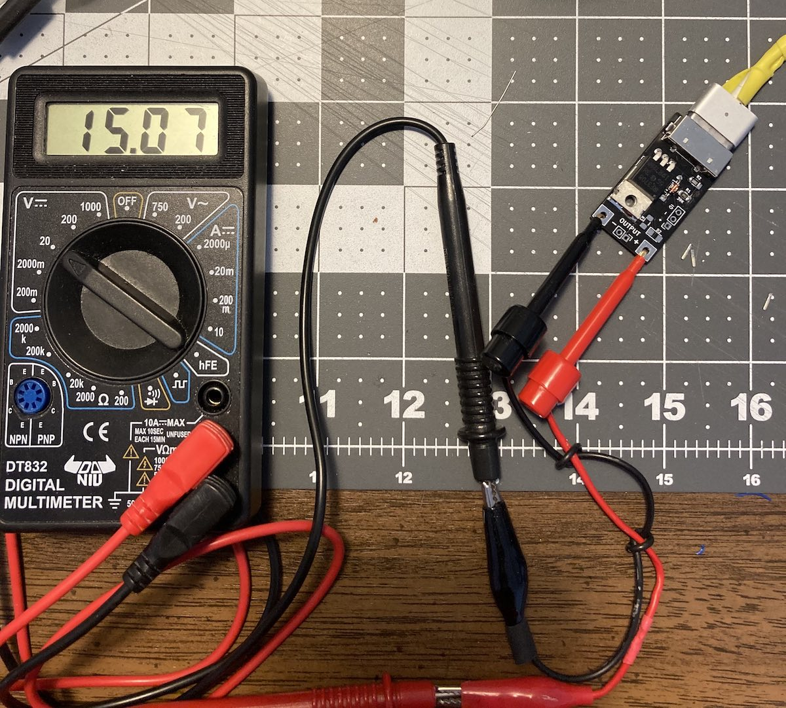

## MagSafe Trigger

Use a MagSafe 2 Power Adapter to power other devices.

Based on info from [Macbook charger teardown from Ken Shirriff's blog](http://www.righto.com/2015/11/macbook-charger-teardown-surprising.html) (see section **Operation of the charger** and [footnote 15](http://www.righto.com/2015/11/macbook-charger-teardown-surprising.html#ref15) and [16](http://www.righto.com/2015/11/macbook-charger-teardown-surprising.html#ref16))

### Schematic

### BOM

- MagSafe 2 "female" connector/jack
  - Harvested from faulty port
  - Is also available on aliexpress/ebay usually on a small PCB with a 
- IRF3708 MOSFET TO-220
  - It's what I have on hand. It's considered obsolete but can be purchased from Chinese sellers (via aliexpress, ebay) for $3 shipped for 10 pieces.
- 0.5 Watt 10V Zener diode DO-35
  - It's also what I have on hand.
- 39K Ohm resistor 1206
  - Use to apply low-voltage load to trigger
  - Can probably ok to use 33K-47K Ohm
- 10K Ohm resistor 1206
  - To pull down MOSFET gate to keep it off until full voltage
- LED 1206 (optional)
- 1K2 Ohm resistor 1206 (optional)

MagSafe power adapter output a low voltage until it detects about 39K Ohm load. The low voltage depends on the model and version of the MagSafe adapter and will be between 0.6V to 6V.

The Zener diode blocks current to the MOSFET gate until the voltage is above the Zener’s reverse breakdown voltage. Using a 10V Zener diode keeps the output off until the MagSafe adapter switches to full voltage.

Full voltage is 14.5V to 20V depending on MagSafe model. With the 10V Zener inline the gate voltage when full voltage is between 4.5V to 10V which is enough to fully turn on the MOSFET.

Without the MOSFET blocking current though the OUTPUT,  any load on the OUTPUT will prevent the MagSafe power adapter from switch from low voltage to high voltage..

ID_LED pin is connected to a chip inside the the male connector. It is normally used by Apple laptops to read the type and id/serial number of power supply and to turn on and off the LEDS. It does not need to be used to trigger the full voltage

### PCB Layout

MagSafe jack footprint is based on manual measurements and probably needs tweaking for proper fit. 

### PCB rendering

### Assembly

### Powered

Plugging in a 45 W MagSafe 2 Power Adapter shows 15 V open circuit.

